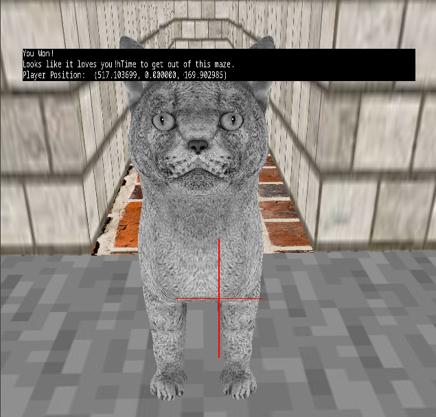

# 3D Game Engine
## Summary
This is a game engine built in class over a semester using OpenGL. This engine has a few different objects / entities such as turrets, projectiles, and a maze exporation bot. The current game set up in the engine is a game where you explore a maze along with a bot that will run away from you. Your goal is to befriend the bot with treats and lead it out of the maze.
## Building
This repo only has linux support in which you build with the included Makefile in the "src/" directory. If you do not have the dependencies for running prgrams with OpenGL, you can install them with the following command.
```
sudo apt install libglew-dev libglm-dev libglfw3-dev
```
## In-game image

